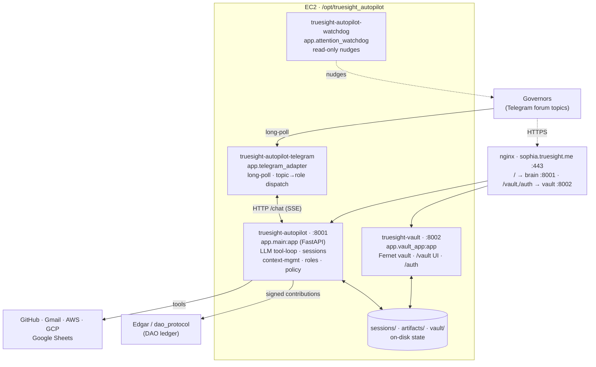

# Sophia (truesight_autopilot)

**Unified AI service for TrueSight DAO — governor chat + autonomous SRE + developer.**

**Public URL: [https://sophia.truesight.me](https://sophia.truesight.me)**

Sophia is the public-facing name of the TrueSight Autopilot service, accessible at `sophia.truesight.me`. The service runs on a dedicated EC2 instance behind an nginx reverse proxy with SSL termination via Let's Encrypt.

## Vision

TrueSight DAO runs on code: market research pipelines, email agents, inventory snapshots, contribution ledgers, DApp pages, tokenomics mirrors. Today, every bug, every GitHub Action failure, every AWS cost spike, every GAS execution error waits for a human to wake up, read an email, open a terminal, and fix it.

**Sophia exists to close that gap.**

It is a persistent cloud service with two modes:

### Reactive Mode — Governor Chat (`POST /chat`)
You talk to it through the DApp chat UI at `dapp.truesight.me/chat.html`:
- *"What did we ship last week?"* → reads context, summarizes PRs
- *"The circle-detect workflow failed — can you fix it?"* → diagnoses, opens PR
- *"Check my AWS costs"* → queries Cost Explorer, reports anomalies
- *"Create a PR that adds retry logic to hit_list_enrich_contact.py"* → implements, tests, opens PR

### Proactive Mode — Autopilot (background loops)
It watches continuously without human input:
- **Gmail** — polls every 5 min for GitHub Action failures, GAS errors, security alerts
- **AWS** — monitors CloudWatch metrics, Cost Explorer spend, Health events
- **GitHub** — listens to webhooks for workflow failures

Both modes share the same brain: **DeepSeek-V3** (30× cheaper than Claude) with full workspace context.

**The human stays in the loop.** The autopilot never auto-merges. Every fix is a PR. You review and merge. The service just ensures the PR is waiting for you when you check GitHub — not the error email.

## Why This Matters

| Before | After |
|---|---|
| GitHub Action fails at 3 AM → you wake up to an email → read logs → open editor → fix → commit → push | Action fails → autopilot reads email → fetches logs → diagnoses → opens PR → you merge at 9 AM |
| EC2 runs out of disk → site goes down → customer complaint → emergency SSH | Disk usage climbs → autopilot alerts → proposes resize PR → you approve |
| AWS bill surprises you at month-end | Daily cost check → anomaly detected → PR to pause non-prod resources |
| GAS execution error → manual script debugging → Stack Overflow rabbit hole | Error email → autopilot parses stack trace → proposes fix in `.gs` or Python equivalent |

## Architecture & Services

Sophia runs as **four systemd services** on a dedicated EC2 box, fronted by nginx
(`sophia.truesight.me`). They're deliberately split so the credential vault and the
Telegram adapter stay responsive even while the brain is busy on a long LLM turn.



| Service (systemd unit) | Entrypoint | Port | Role |
|---|---|---|---|
| **truesight-autopilot** | `uvicorn app.main:app` | 8001 | **The brain.** The `/chat` LLM tool-loop (DeepSeek), session store + context management, role/policy gating, the proactive monitors, and all ~34 tools. |
| **truesight-autopilot-telegram** | `python -m app.telegram_adapter` | — | **Telegram adapter.** Long-polls Telegram, maps each forum topic to a role, dispatches the thread to the brain's `/chat`, streams the reply back. |
| **truesight-autopilot-watchdog** | `python -m app.attention_watchdog` | — | **Attention watchdog.** Read-only — nudges in Saved Messages about unanswered asks. Never acts on your behalf. |
| **truesight-vault** | `uvicorn app.vault_app:app` | 8002 | **Credential vault.** Fernet-encrypted on-disk store + the governor-only `/vault` web UI (DAO-Identity RSA login) + the `/auth` email-verification routes. Separate worker so it stays up when the brain is busy. |

All four are restarted together by `deploy_autopilot` and `scripts/deploy.sh`. nginx
(`config/nginx/sophia.conf`) terminates HTTPS, routes `/vault` + `/auth` to :8002 and
everything else to :8001, and proxies `/dao/*`, `/proxy/gas`, etc. on to the separate
`dao_protocol` service.

### Repository layout

```text
app/
  main.py               # the brain: FastAPI app, /chat LLM tool-loop, session store,
                        #   context management (externalize / compact / token-trim), /chat/context
  telegram_adapter.py   # Telegram long-poll adapter            -> -telegram service
  attention_watchdog.py # read-only nudge watchdog              -> -watchdog service
  vault_app.py          # vault FastAPI app (:8002)             -> -vault service
  vault.py              # Fernet-encrypted credential store (writes vault/ on disk)
  vault_routes.py       # /vault web UI + /vault/api/* (DAO-Identity RSA login)
  auth.py auth_routes.py# JWT + RSA signature verification + email onboarding
  roles.py              # forum-topic -> role -> {allowed tools, system prompt}
  policy.py             # per-governor permission enforcement on tool calls
  governor_registry.py  # who's a governor (treasury-cache/dao_members.json)
  tool_registry.py      # auto-discovers every TOOL_SPEC under app/tools/
  llm/                  # LLM provider abstraction (DeepSeek via litellm, ...)
  context.py config.py  # system prompt + settings
  followup_*.py engagement.py            # proactive follow-up monitoring
  aws_monitor.py email_poller.py research.py daily_briefing.py  # proactive monitors
  tools/                # ~34 tool modules (ssh_run, deploy, git, sheets, qr,
                        #   read_tool_result, recall_context, pin_note, ...)
  templates/vault/      # Jinja2 templates for the /vault web UI
config/nginx/           # sophia.conf - HTTPS termination + routing
systemd/                # the 4 *.service unit files
scripts/                # deploy.sh, launch_ec2.sh, user-data.sh
tests/                  # pytest suite (+ conftest.py redirects writable state to tmp)

# Runtime state - on the box only, gitignored:
sessions/               # per-thread conversation transcripts (<md5>.json)
artifacts/              # offloaded large tool results (context Pillar A; chmod 700)
vault/                  # vault.key (Fernet master key, chmod 600) + encrypted store
```

<details>
<summary>Legacy conceptual data-flow sketch (proactive-monitor view)</summary>

```
┌─────────────────────────────────────────────────────────────────────────────┐
│                         Sophia — truesight_autopilot (EC2)                  │
│  ┌─────────────┐  ┌─────────────┐  ┌─────────────┐  ┌─────────────────────┐ │
│  │  collector  │  │  classifier │  │  diagnosis  │  │   fix_generator     │ │
│  │  (pollers)  │→ │  (LLM/rules)│→ │   engine    │→ │   (code + infra)    │ │
│  └─────────────┘  └─────────────┘  └─────────────┘  └─────────────────────┘ │
│         ↑                                                    │              │
│         │                                              ┌─────┴─────┐        │
│         │                                              ▼           ▼        │
│         │                                       ┌──────────┐ ┌──────────┐  │
│         │                                       │  GitHub  │ │   AWS    │  │
│         │                                       │   PR     │ │  Action  │  │
│         │                                       └──────────┘ └──────────┘  │
│         │                                                                     │
│  ┌──────┴─────────────────────────────────────────────────────────────────┐  │
│  │                        DATA SOURCES                                     │  │
│  ├─────────────────┬─────────────────┬─────────────────┬──────────────────┤  │
│  │   Gmail IMAP    │  GitHub API     │  AWS APIs       │   GCP APIs       │  │
│  │                 │                 │                 │                  │  │
│  │ • GH Actions    │ • Workflow runs │ • CloudWatch    │ • Cloud Monitor  │  │
│  │   failures      │ • PRs / Issues  │   (EC2 metrics) │ • Billing        │  │
│  │ • GAS errors    │ • Code contents │ • Cost Explorer │ • Error Reports  │  │
│  │ • Security      │ • Dependabot    │ • EC2 status    │                  │  │
│  │   alerts        │                 │ • RDS / S3      │                  │  │
│  └─────────────────┴─────────────────┴─────────────────┴──────────────────┘  │
└─────────────────────────────────────────────────────────────────────────────┘
                              │
                              ▼
                    ┌─────────────────┐
                    │   Edgar (DAO)   │
                    │  Log every fix  │
                    │  as contribution│
                    └─────────────────┘
```

</details>

## Monitors

| Source | What | Frequency | Action |
|---|---|---|---|
| **Gmail** | GitHub Action failure emails | Every 5 min | Fetch logs → diagnose → open PR |
| **Gmail** | Google Apps Script error emails | Every 5 min | Parse stack trace → propose fix |
| **GitHub API** | Workflow run status (webhook backup) | Event-driven | Same as above |
| **AWS CloudWatch** | EC2 CPU, memory, disk, status checks | Every 5 min | Alert on anomaly |
| **AWS Cost Explorer** | Daily spend by service | Daily | Report + anomaly alert |
| **AWS Health** | Regional outages affecting resources | Hourly | Alert |
| **GCP Cloud Monitoring** | GCP resource health | Every 5 min | Alert |
| **GCP Billing** | Daily GCP spend | Daily | Report + anomaly alert |

## Safety

- **Never auto-merges.** All fixes open as PRs for human review.
- **Dry-run mode.** Set `DRY_RUN=true` to print plans without writing.
- **Rate limited.** Max 5 PRs/day per repo; configurable via `MAX_PR_PER_DAY`.
- **Dedicated identity.** Edgar contributions are signed by `autopilot@agroverse.shop`, not your personal key.
- **Cost capped.** DeepSeek-V3 is ~$0.001 per diagnosis. A month of heavy use costs less than a coffee.

## Quick Start

```bash
cd truesight_autopilot
python3 -m venv .venv
source .venv/bin/activate
pip install -r requirements.txt

# Copy and fill in credentials
cp .env.example .env
# Edit .env — see SETUP.md

# Run locally (dry-run recommended first)
DRY_RUN=true python -m uvicorn app.main:app --host 0.0.0.0 --port 8001

# Check health
curl http://localhost:8001/health

# Test oracle advisory (replaces GAS bridge)
curl "http://localhost:8001/oracle-advisory?mode=day&primary_number=1&primary_name=The+Creative&primary_judgment=Work+with+the+creative+force"
```

## Deployment

### Server Layout (EC2)

The autopilot runs on a **dedicated EC2 instance** (`us-east-1`, t3.small, IP `100.52.234.163`) separate from `seni_ror` (Edgar) to protect critical infrastructure.

**Code location:** `/opt/truesight_autopilot`
```bash
# SSH in (Host alias configured in ~/.ssh/config as "sophia")
ssh sophia

# Navigate to the deployment
cd /opt/truesight_autopilot

# Key directories (full tree: see "Repository layout" above)
app/              # FastAPI application code (brain, adapter, watchdog, vault)
scripts/          # launch_ec2.sh, deploy.sh, user-data.sh
systemd/          # the 4 *.service unit files
sessions/         # per-thread transcripts   (runtime, gitignored)
artifacts/        # offloaded tool results    (runtime, gitignored)
vault/            # vault.key + encrypted store (runtime, gitignored)
```

**Environment file:** `/opt/truesight_autopilot/.env` (chmod 600)
```bash
# View current env vars (secrets redacted)
grep -v '^#' /opt/truesight_autopilot/.env | sed 's/=.*/=*/'
```

**Systemd services** (four — see the Services table above):
```bash
# Status of all four
sudo systemctl status truesight-autopilot truesight-autopilot-telegram \
                      truesight-autopilot-watchdog truesight-vault

# Logs (follow) — pick the service
sudo journalctl -u truesight-autopilot -f        # the brain
sudo journalctl -u truesight-vault -f            # the credential vault

# Restart after code or env changes (deploy_autopilot / deploy.sh restart all four)
sudo systemctl restart truesight-autopilot truesight-autopilot-telegram \
                       truesight-autopilot-watchdog truesight-vault

# Enable/disable auto-start on boot
sudo systemctl enable truesight-autopilot
sudo systemctl disable truesight-autopilot
```

**Deploy from local:**
```bash
# From your Mac, in the truesight_autopilot repo:
./scripts/deploy.sh
```

This rsyncs the repo to `/opt/truesight_autopilot` on the EC2 instance, reinstalls dependencies, and restarts the systemd service.

### Telegram forum topics — execution handoff (governor-prompted)

Sophia can open a new **forum topic** in the working group on request (the
`create_telegram_topic` tool) — the landing pad for the local-LLM → Sophia
execution handoff: a governor crafts a plan + roadmap with a local LLM, commits
the roadmap to `agentic_ai_context`, then triggers Sophia (e.g. `dao_client`'s
`ping_sophia`, governor-signed). Sophia opens a dedicated topic, posts a
kickoff, and the governor continues monitoring there (each topic is its own
autopilot session).

**One-time setup (operator):**
- The group must have **Topics enabled** (Group Settings → Topics).
- **Promote Sophia's bot to a group admin with the "Manage Topics" right.**
  Without this the Bot API rejects topic creation.
- Set **`TELEGRAM_HOME_GROUP_ID`** in the box `.env` to that group's numeric
  supergroup id (`-100…`) so the off-Telegram `/chat` handoff trigger knows
  where to open topics.

### Telegram attention watchdog — one-time login (operator-only)

`app/attention_watchdog.py` (unit `truesight-autopilot-watchdog`) watches the
operator's **own Telegram account** via a read-only MTProto user-session and
nudges unanswered question-shaped DMs/mentions to his Saved Messages (4 h SLA,
2 h when the ask mentions a date, daily 9 am digest). It needs a session file
that only the operator can create — `deploy.sh` keeps the unit **stopped**
until `.telethon_watchdog.session` exists.

**One-time setup (~10 min):**

1. **API credentials:** log into https://my.telegram.org → *API development
   tools* → create an app (any name) → copy `api_id` + `api_hash`.
   ⚠️ The my.telegram.org login code arrives **inside the Telegram app** (the
   verified "Telegram" service chat) — never SMS — and repeated requests
   trigger **silent rate-limiting** (wait ≥ 1 h, then one clean retry).
2. **Add to the box env:**
   ```bash
   ssh sophia "printf 'TELEGRAM_API_ID=<id>\nTELEGRAM_API_HASH=<hash>\n' >> /opt/truesight_autopilot/.env"
   ```
3. **Interactive login** (a *second* code arrives in the Telegram app):
   ```bash
   ssh -t sophia "cd /opt/truesight_autopilot && .venv/bin/python scripts/telethon_login.py"
   ```
   Prompts: phone (international format) → login code → 2FA password if set.
   Sends a 👋 confirmation to Saved Messages.
4. **Start:**
   ```bash
   ssh sophia "sudo systemctl enable --now truesight-autopilot-watchdog"
   ```
   Healthy log line: `watchdog up as <username>` (`journalctl -u truesight-autopilot-watchdog`).

**Operational rules:**

- `.telethon_watchdog.session` is **full account access**: gitignored, never
  commit, keep AMIs containing it private. Revoke any time from Telegram →
  Settings → Devices.
- **Never run the session from two machines at once** — concurrent clients on
  one auth key raise `AuthKeyDuplicatedError` and Telegram **permanently
  invalidates the session**. During blue/green instance swaps: stop
  `truesight-autopilot-watchdog` + `truesight-autopilot-telegram` on the old
  box **before** booting an AMI clone, then repoint the Elastic IP.
- If Telegram ever invalidates the session (rare, or after a duplication
  event), re-run step 3 — `TELEGRAM_API_ID/HASH` in `.env` stay valid.
- Tuning via env: `WATCHDOG_NUDGE_HOURS` (4), `WATCHDOG_URGENT_NUDGE_HOURS`
  (2), `WATCHDOG_DIGEST_HOUR` (9), `WATCHDOG_TZ` (America/Los_Angeles).

## Environment

See `.env.example` for required variables. Key credentials:

| Variable | Purpose | Status |
|---|---|---|
| `TRUESIGHT_DAO_AUTOPILOT` | GitHub fine-grained PAT (Contents + PR write) | ✅ Ready |
| `GMAIL_TOKEN_JSON` | Full `token.json` from `market_research/credentials/gmail/` | ✅ Ready |
| `DEEPSEEK_API_KEY` (or `DEEPSEEK_SDK`) | From platform.deepseek.com | ✅ Ready |
| `EMAIL` / `PUBLIC_KEY` / `PRIVATE_KEY` | Dedicated Edgar identity | 🆕 Generate via `truesight-dao-auth login` |
| `AWS_ACCESS_KEY_ID` / `AWS_SECRET_ACCESS_KEY` | From `cypher_def/.env` (TRUESIGHT_DAO_AUTOPILOT_AWS_*) | ✅ Ready |
| `TELEGRAM_API_ID` / `TELEGRAM_API_HASH` | my.telegram.org (attention watchdog; see § Telegram attention watchdog) | ✅ On box (2026-06-06) |

Full credential audit: `agentic_ai_context/API_CREDENTIALS_DOCUMENTATION.md` §10

## How It Works (One Example)

1. `detect_circle_hosting.yml` fails at 04:17 UTC
2. GitHub emails `garyjob@agroverse.shop`: "Workflow run failed"
3. Autopilot polls Gmail, classifies as `github_failure`
4. Fetches workflow run logs via GitHub API
5. DeepSeek-V3 reads the log + `detect_circle_hosting_retailers.py`:
   ```json
   {
     "root_cause": "ModuleNotFoundError: No module named 'gspread' — dependency missing in requirements.txt",
     "proposed_fix": "Add gspread>=6.0.0 to requirements.txt",
     "files_to_edit": "requirements.txt"
   }
   ```
6. Autopilot creates branch `fix/detect-circle-hosting-missing-dep`
7. Commits the fix
8. Opens PR with diagnosis in the body
9. Logs 5-minute contribution to Edgar
10. You wake up, review the PR, click merge

## History

This repo merges two previous services:
- **`governor_chatbot_service`** — conversational AI for DAO governors (now the `/chat` endpoint)
- **`truesight_autopilot`** (original scaffold) — autonomous SRE + developer (now the background loops + proactive PRs)

Merged 2026-05-03. DeepSeek-V3 replaces Kimi + Claude for all LLM workloads. Deployed on a **dedicated EC2** separate from `seni_ror` (Edgar) to protect critical infrastructure.

## Code Modification (Agentic Loop)

The autopilot can now modify **any TrueSightDAO repo** through governor chat:

| Repo | Scope |
|------|-------|
| `dapp` | DApp HTML/JS pages |
| `tokenomics` | GAS, Python scripts |
| `truesight_me` / `truesight_me_prod` | Static site |
| `agroverse_shop` / `agroverse_shop_prod` | E-commerce site |
| `dao_client` | Python CLI + auth |
| `market_research` | Research pipelines |
| `sentiment_importer` | Edgar Rails API |
| `truesight_autopilot` | Self-healing |

Tools available in the agentic loop: `read_file`, `edit_file`, `create_file`, `delete_file`, `grep_code`, `py_compile`. Every change opens a **DRAFT PR** — never auto-merges. See `agentic_ai_context/AUTOPILOT_CODE_MODIFICATIONS.md` for full spec.

## Related

- [`docs/LLM_PROVIDER_ROADMAP.md`](docs/LLM_PROVIDER_ROADMAP.md) — Phased plan to introduce a provider ABC (DeepSeek / BigModel / Kimi / Grok / Gemini) and per-call usage logging. Read before refactoring `llm_client.py`, `grok_client.py`, or `gemini_client.py`.
- [`TrueSightDAO/truesight_autopilot_transcript`](https://github.com/TrueSightDAO/truesight_autopilot_transcript) — Append-only audit trail (transcripts + token usage) produced by this service. See its [`AGENTS.md`](https://github.com/TrueSightDAO/truesight_autopilot_transcript/blob/main/AGENTS.md), [`SCHEMA.md`](https://github.com/TrueSightDAO/truesight_autopilot_transcript/blob/main/SCHEMA.md), and [`PROVIDERS.md`](https://github.com/TrueSightDAO/truesight_autopilot_transcript/blob/main/PROVIDERS.md).
- `agentic_ai_context/API_CREDENTIALS_DOCUMENTATION.md` §10 — Credential audit and readiness
- `agentic_ai_context/SETUP_REQUIREMENTS.md` — Autopilot prerequisites and blockers
- `agentic_ai_context/AUTOPILOT_CODE_MODIFICATIONS.md` — Full agentic loop spec
- `market_research` — Primary repo the autopilot will monitor and fix
